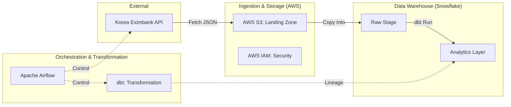

# Data Pipeline Architecture (Daily Exchange Rate)

본 문서는 한국수출입은행 API를 활용한 일일 환율 데이터 파이프라인의 구성요소 및 데이터 흐름을 정의합니다.

## 1. Architecture Overview (Data Flow)

데이터는 아래와 같은 선형 구조 및 피드백 루프를 거쳐 최종 데이터 웨어하우스에 적재됩니다.

---

## 2. Component Details

### 🟢 Ingestion Layer (수집 계층)

* **Data Source**: 한국수출입은행 일일 환율 API (Open API)
* 외부 금융 데이터를 주기적으로 호출하여 Raw 데이터를 확보합니다.

* **Data Lake (Landing Zone)**: AWS S3 (Object Storage)
* API에서 수집한 가공 전 JSON/CSV 파일을 보관하는 1차 저장소입니다.

### 🔵 Storage & Compute Layer (저장 및 연산 계층)

* **Cloud Data Warehouse (CDW)**: Snowflake
* 대규모 데이터 연산 및 분석을 담당하는 핵심 엔진입니다.

* **Access Management**: AWS IAM
* S3와 Snowflake 간의 데이터 전송(External Stage) 권한 및 보안 정책을 관리합니다.

### 🟡 Transformation Layer (변환 계층)

* **Data Modeling & Lineage**: dbt (Data Build Tool)
* SQL을 기반으로 Raw 데이터를 비즈니스 로직에 맞게 변환하고 데이터 간의 관계(Lineage)를 관리합니다.

### 🟣 Orchestration & Runtime (운영 및 자동화)

* **Workflow Orchestrator**: Apache Airflow
* 전체 파이프라인의 스케줄링, 실패 시 재시도(Retry), Task 간 의존성을 관리합니다.

* **Containerization**: Docker
* 개발-스테이징-운영 환경 간의 일관성을 유지하기 위한 컨테이너 환경입니다.

* **Platform OS**: Linux (WSL2 Environment)
* Docker 및 Airflow 구동을 위한 표준 런타임 환경입니다.

### ⚪ DevOps & Maintenance (형상 관리)

* **Version Control System (VCS)**: GitHub
* dbt 모델링 쿼리, Airflow DAG 코드 및 인프라 설정 파일을 관리하는 코드 저장소입니다.

---

## 3. Implementation Summary

* **Type**: Batch ETL Pipeline
* **Frequency**: Daily (Once a day)
* **Deployment**: Dockerized Environment